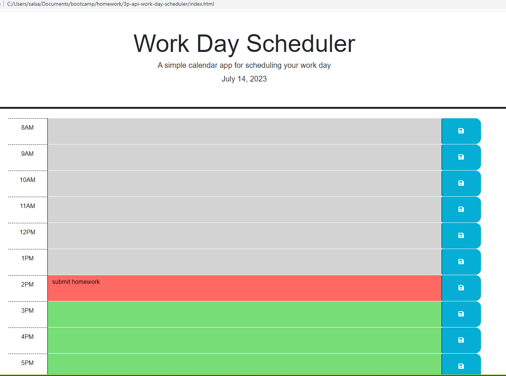

# Third Party APIs - Daily Scheduler Homework Assignment

## What I attempted to do:

Create a password calendar with typical work day hours that is color coded according to past, present, and future hour time blocks. The user can enter and save tasks for each time block.This app uses jQuery and dynamically updated HTML.

## Screen shot from one working page:

## Link to the working version of the code

https://github.com/Jacqueline-Stiehl/3p-api-work-day-scheduler-jstiehl

## URL of deployed application

https://jacqueline-stiehl.github.io/password-generator-javascript/

## Acknowledgements

Tips from University of Minnesota Full Stack Bootcamp instructor Gary Almes and notes from class sessions.

Tips from class TAs: Katy Vincent, Austin Slater, Jessica Guico.

Tips from tutoring session with Collin Porter through University of Minnesota coding boot camp.

Resource: in-class mini project titled Project Tracker.

Tips from jQuery API website located here: https://api.jquery.com/
